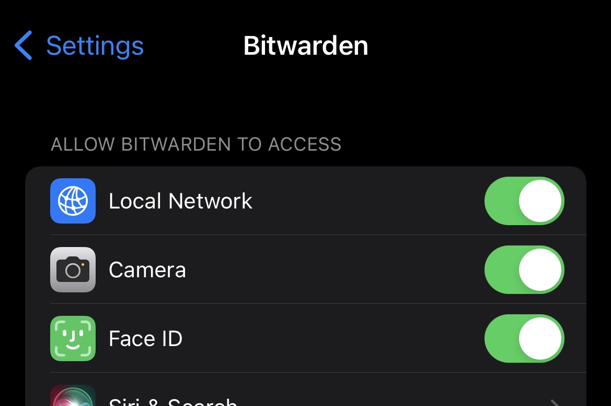

# Running Vaultwarden in local network

This is by far the easiest method to run a [Vaultwarden](https://github.com/dani-garcia/vaultwarden) instance in private network. All steps could be found in official [wiki](https://github.com/dani-garcia/vaultwarden/wiki).

## Pre-requisites

1. Docker installed
2. Domain name
3. [Cloudflare](https://www.cloudflare.com/) free account

## Cloudflare setup & API token

Just follow the official guide [here](https://github.com/dani-garcia/vaultwarden/wiki/Running-a-private-vaultwarden-instance-with-Let%27s-Encrypt-certs#cloudflare-setup) to setup your domain and get the API token.

## Build custom image to support cloudflare dns

[Dockerfile](Dockerfile)

```dockerfile
FROM caddy:2.6.4-builder-alpine AS builder

RUN xcaddy build --with github.com/caddy-dns/cloudflare

FROM caddy:2.6.4-alpine

COPY --from=builder /usr/bin/caddy /usr/bin/caddy
```

Build docker image

```sh
docker build -t caddy:2.6.4-alpine-cf .
```

## Prepare caddy settings

[Caddyfile](Caddyfile)

```caddyfile
{$DOMAIN}:443 {
  log {
    output file /data/access.log {
      roll_size 10MB
      roll_keep 10
    }
  }

  tls {
    dns cloudflare {$CLOUDFLARE_API_TOKEN}
  }

  encode gzip

  reverse_proxy /notifications/hub vaultwarden:3012
  reverse_proxy vaultwarden:80 {
    header_up X-Real-IP {remote_host}
  }
}
```

## Run containers

[docker-compose.yml](docker-compose.yml)

```yml
---

services:
  vaultwarden:
    image: vaultwarden/server:1.28.0-alpine
    container_name: vaultwarden
    restart: unless-stopped
    environment:
      - ADMIN_TOKEN=THE_ADMIN_TOKEN # The admin token to use for administration tasks.
      - WEBSOCKET_ENABLED=true  # Enable WebSocket notifications.
    volumes:
      - //d/vaultwarden/data:/data

  caddy:
    image: caddy:2.6.4-alpine-cf
    container_name: caddy
    restart: unless-stopped
    environment:
      - DOMAIN=THE_DOMAIN_NAME_TO_USE
      - EMAIL=THE_EMAIL_TO_USE
      - CLOUDFLARE_API_TOKEN=THE_CLOUDFLARE_API_TOKEN
    ports:
      - 80:80
      - 443:443
    volumes:
      - //d/docker/vaultwarden/caddy/Caddyfile:/etc/caddy/Caddyfile:ro
      - //d/docker/vaultwarden/caddy/config:/config
      - //d/docker/vaultwarden/caddy/data:/data
...

```

Run containers

```sh
docker-compose up -d
```

## App setting

Since the app is running in private network, the [Bitwarden app](https://github.com/bitwarden/mobile) will refuse to connect to private ip address unless `Local Network` is enabled.

`Settings` / `Bitwarden` / `Local Network`


